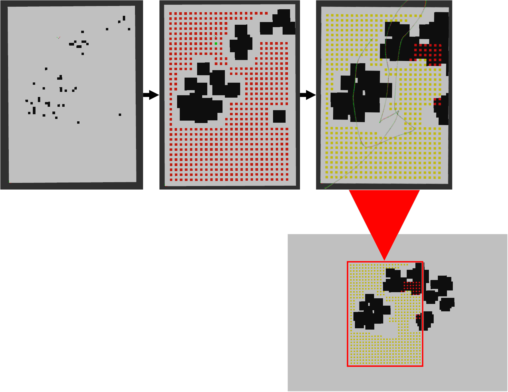

# Gazebo Ground Truth Occupancy Grid

### This is a tool to evaluate the performance and accuracy of the [safety_pipeline](https://github.com/telemc97/safety_pipeline.git).

This module reconstructs a ground truth occupancy grid of the whole Gazebo <code>.world</code>, based on the position of each model which is available from <code>gazebo/model_states</code> topic. 
The part of the map that the [safety_pipeline](https://github.com/telemc97/safety_pipeline.git) has observed is then compared to the coresponfing part of the whole Ground Truth Occupancy Grid. Consequently the **IoU** is derived along with the **percentage of landing points that are indeed unoccupied** and the **distance to the closest landing obstacle** in upon landing.

### Parameters
<ul>
  <li><code>~exec_rate</code></li>
  Execution rate of the tool
  <li><code>~map_size</code></li>
  Size of Occupancy Grid
  <li><code>~resolution</code></li>
  <li><code>~safety_radius</code></li>
  <li><code>~Occupancy_Grid</code></li>
  <li><code>~Occupancy_Grid</code></li>
  <li><code>~camera1_info_topic</code></li>
</ul>

### Subscribing Topics
<ul>
  <li><code>/gazebo/model_states</code></li>
  <li><code>/occupancy_output</code></li>
  Output of the Landing_Commander module from <a href="https://github.com/telemc97/safety_pipeline.git">safety_pipeline</a>
  <li><code>/Debug_Landing_Targets</code></li>
  A list of total available landing targets produced by the Landing_Commander module from <a href="https://github.com/telemc97/safety_pipeline.git">safety_pipeline</a>
  <li><code>/mavros/extended_state</code></li>
  <li><code>/mavros/local_position/pose</code></li>
</ul>

### Publishing Topics
<ul>
  <li><code>/Ground_Truth_Occupancy_Grid</code></li>
  Occupancy Grid of the whole world
  <li><code>/Ground_Truth_Occupancy_Grid_Cropped</code></li>
  The part of <code>/Ground_Truth_Occupancy_Grid</code> that the <a href="https://github.com/telemc97/safety_pipeline.git">safety_pipeline</a> has observed
  <li><code>/Ground_Truth_Debug</code></li>
  Percentage of available landing points that are indeed unoccupied. IoU of the two maps and the distance to the closest landing obstacle in upon landing. 

</ul>
